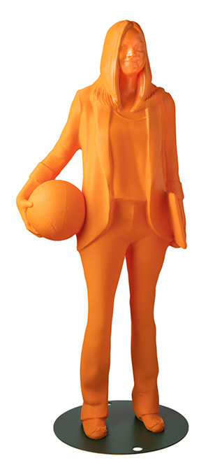
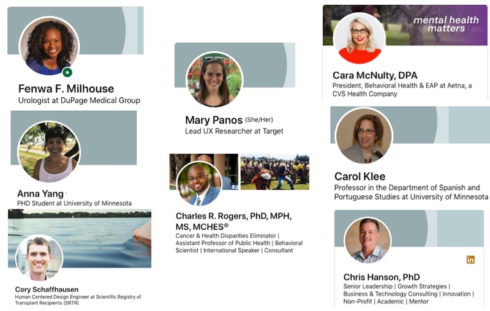
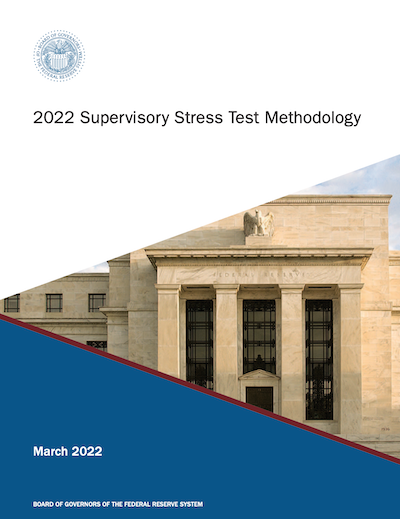

---

output:
  xaringan::moon_reader:
    seal: false
    self_contained: true
    css: custom.css
    nature:
      slideNumberFormat: "%current%"
      highlightStyle: github
      highlightLines: true
      ratio: 16:9
      countIncrementalSlides: false
---

class: inverse center middle

# My Journey as a Statistician

## Lindsey Dietz, PhD
### UMN School of Statistics Consulting Class
### April 11, 2022

```{r setup, include=FALSE}
options(htmltools.dir.version = FALSE)
knitr::opts_chunk$set(
  fig.width=9, fig.height=3.5, fig.retina=3,
  out.width = "100%",
  cache = FALSE,
  echo = TRUE,
  message = FALSE, 
  warning = FALSE,
  hiline = TRUE
)
```

```{r xaringan-themer, include=FALSE, warning=FALSE}
library(xaringanthemer)
style_mono_accent(
  base_color = "#1c5253",
  header_font_google = google_font("Josefin Sans"),
  text_font_google   = google_font("Montserrat", "300", "300i"),
  code_font_google   = google_font("Fira Mono")
)
```
---

## Disclaimer

The views expressed in this presentation are strictly my own. They do not necessarily represent the position of the Federal Reserve Bank of Minneapolis or the Federal Reserve System.

---

## Who am I?

.left-column[
+ [Financial Economist/Stress Testing Production Function Lead @ Federal Reserve Bank of Minneapolis](https://www.minneapolisfed.org/news-releases/2021/dietz-recognized-for-excellence-in-bank-supervision)
    - I lead the team working on implementation, execution, and analysis of models for stress testing the nation's largest banks.

+ R Enthusiast and STEM diversity advocate
    - [Co-creator of the noRth R user conference](https://rnorthconference.github.io/)
    - [Co-organizer of the R Ladies - Twin Cities meetup](https://www.meetup.com/rladies-tc/members/)
    - [IF/THEN AAAS STEM Ambassador](https://www.si.edu/womensfutures)

]

.right-column[
```{r echo=FALSE, out.width= "85%"}

```
]
---

## My UMN Journey

- B.S. and M.S. math degrees from University of Minnesota - Duluth (2006; 2008)

- PhD in statistics from University of Minnesota - Twin Cities (2016)
    + Teaching Assistant for multiple courses in 5 semesters
    + Fellowships for 4 semesters
    + Student consulting in School of Stats consulting center for 1 semester
    + Student consulting internship for 1 summer
    + Independent tutor and statistical consultant

---

## Summer Consulting Work (2013)

- Following my 2nd year of PhD study, I worked in Dr. Patricia Frazier's Psychology Lab for ~20 hrs/week for 8 weeks

- She and her lab group were studying the impact of an intervention on student stress
     + They measured student stress at various time points before and after the intervention
     
- Another statistics student and I fit a linear mixed model to the data and contributed to the [final published work](https://www.tandfonline.com/doi/abs/10.1080/10615806.2014.987666#.VNthNmTF9_0)

---

## School of Statistics Consulting

- In Fall 2014, I worked as a student statistical consultant for the School of Stats

- Some projects I worked on:
    + [Nonlinear mixed effects model for fish behavior](https://link.springer.com/article/10.1007%2Fs10886-017-0833-0)
    + Survival analysis on animal distress following surgery
    + [Permutation testing on brainstorming ](https://asmedigitalcollection.asme.org/mechanicaldesign/article-abstract/137/7/071403/376216/Large-Scale-Needfinding-Methods-of-Increasing-User?redirectedFrom=fulltext)
 
---

## Independent Consulting

 - [Ordinal random effect models for pronunciation differences in the letter 's' in the Lima, Peru area](https://www.degruyter.com/document/doi/10.1515/shll-2018-0002/html)
 - Logistic regression to understand factors the affect patient incontinence following surgery.
 - [Time series analysis regarding use patterns of homeless shelters](https://www.tandfonline.com/doi/abs/10.1080/10511482.2016.1158200?journalCode=rhpd20)
 - [Multivariate linear mixed model for assessing the role of human resources in the Kauffman Firm small business survey](https://conservancy.umn.edu/bitstream/handle/11299/173935/Hanson_umn_0130E_14970.pdf?sequence=1&isAllowed=y)

---

## Tangible Benefits

- Papers - Advanced statistical technique + applied field = Novel Research!
    
- Collaborators - good work means people will want to work with you again
    
- Money - more expertise, publications, credibility mean you can charge more for consulting

---

## Connections!

.center[

]

---

## Reflections on Consulting Work

 - Problem solving 
 - Code first data science
    + Creating reusable code for handoff to lab team
 - Communication
    + Teach a new method or interpreting results for unfamiliar audiences
    + Becoming a two-way filter
 - Learning specific statistical methods that each field utilizes
 - Writing technical documentation
    
---

## My Work at the Federal Reserve (2016 - present)

.left-column[
- Began as a Soundness Validator in 2016
- Transitioned to a Senior Quantitative Analyst in 2019
- Promoted to Financial Economist and Implementation Lead in 2020
- Promoted to Financial Economist Manager and Stress Testing Production Function Lead in 2022
]

.right-column[

]

---

## Stress Testing

.left-column[
*The Federal Reserve estimates the effect of supervisory scenarios on the regulatory capital ratios of firms participating in the supervisory stress test by projecting net income and other components of regulatory capital for each firm over a nine-quarter projection horizon. Projected net income, adjusted for the effect of taxes, is combined with non-common capital action assumptions and other components of regulatory capital to produce post-stress capital ratios.*

-- [2022 Supervisory Stress Testing Methodology Disclosure](https://www.federalreserve.gov/publications/files/2022-march-supervisory-stress-test-methodology.pdf)
]

.right-column[

]
---

## Quantitative Model Validation

.left-column[
*Model validation is the set of processes and activities intended to verify that models are performing as expected, in line with their design objectives and business uses.*

--[Federal Reserve and OCC SR 11-7](https://www.federalreserve.gov/supervisionreg/srletters/sr1107.htm)
]

.right-column[

]
---

## Quantitative Model Validation - Key Skills

 - Risk identification 
     - Can you identify where a model might be conceptually flawed or performing poorly?  Can you design testing to assess your hypotheses? 
 - Reading, running, and updating code
     - Are you familiar with R, Python, SAS, Matlab, Stata, C, C++, Fortran, etc.?
     - How would you prioritize which code to review?
 - Collaboration 
     - How can you leverage expertise around you to learn and critically assess models in a short period of time?
 -  Technical writing 
     - Can you communicate your work and conclusions in detail and in a useful executive summary?

---

## Quantitative Analysis

A **Quantitative Analyst** seeks to understand behavior through mathematical and statistical modeling, measurement, and research. 


---

## Quantitative Analysis - Key Skills

 - Research Skills
    - Can you learn a quantitative method and implement it?
    - Can you explain the value of a new method?
 - Programming
    - Are you an expert in at least one or more programming language?
    - Are you continuously developing this skill?
 - Time Management
    - Can you work on several projects at once?
    - Can you balance your time on the technical work and the communication work?
 - Communication
    - Can you explain the limitations and impacts of your analyses to a non-technical audience?

---

## Transitioning to Quantitative Leadership and Management

Some key changes I've experienced going from an independent contributor to a leader/manager:

 - You are directly dependent on others to meet your goals
 - You are responsible for the work of others and for doing work for your managers
 - Buy-in of colleagues and staff is now essential to move projects forward
 - Prioritization is important to gaining buy-in on short- and long-term vision
 - Decisions have to be made without information or time to dig in
 - You need to use your "political capital" wisely 

---

class: inverse center middle

# Questions?


<style type="text/css">
.remark-slide-content {
    font-size: 26px;
    padding: 1em 1em 1em 1em;
}

</style>
